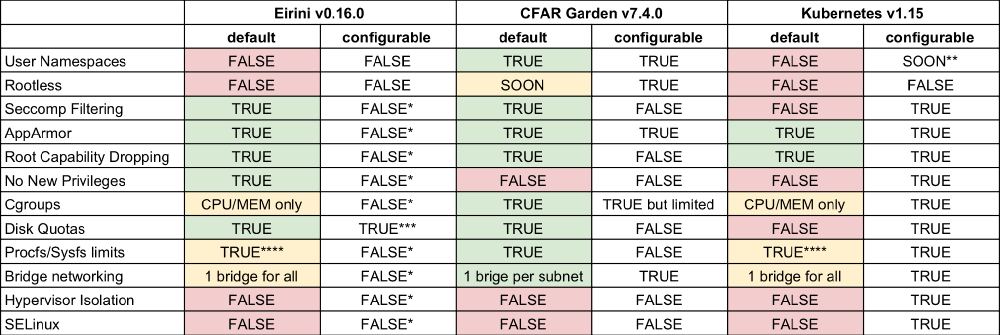

# Security Overview

The following table provides an overview of container security mechanisms across various container systems.
Table last updated 08/07/19. [Link to spreadsheet](https://docs.google.com/spreadsheets/d/1Rwg-C5B4yhyqUrKe_9ozhpiPKpo0Ck6RYBIKC0uzzvQ/edit?usp=sharing)

* \* Possible with [mutating webhooks](https://kubernetes.io/docs/reference/access-authn-authz/extensible-admission-controllers/#webhook-configuration)
* \*\* https://github.com/kubernetes/kubernetes/pull/64005
* \*\*\* Fewer masked paths than garden/docker (e.g. /proc/scsi)

* User Namespaces - False, not possible in Kubernetes yet
* Rootless - False, not possible in Kubernetes yet
* Seccomp - Soon, [relevant Pivotal Tracker story](https://www.pivotaltracker.com/story/show/167127083)
* AppArmor - True, runtime default is applied
* Root Capability Dropping - True, runtime default is applied
* No New Privileges - Soon, [relevant Pivotal Tracker story](https://www.pivotaltracker.com/story/show/167129301)
* Cgroups - True if container processes' access to physical resources restricted by Cgroups
* Disk Quotas - False, not possible in Kubernetes yet
* Procfs/Sysfs limits - True, runtime default is applied
* Bridge networking - Depends, see table for further info
* Hypervisor Isolation - True if Kubernetes is deployed [with this runtime](https://github.com/kubernetes/frakti)
* SELinux - False, can be [configured in the pod definition](https://kubernetes.io/docs/tasks/configure-pod-container/security-context/#assign-selinux-labels-to-a-container)

* Table inspired by: https://blog.jessfraz.com/post/containers-security-and-echo-chambers

## Environments

* Cloud Foundry Application Runtime v7.4.0 - Standard deployment on Xenial trusty stemcell
* Kubernetes v1.13.3 - Standard deployment on GCP
